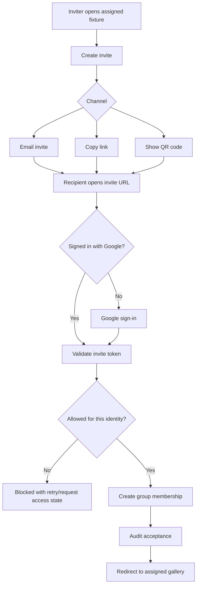

# Access Invitations

Access invitations are the Track B-friendly way for family members, event
organizers, Real Estate clients, or other assigned gallery members to bring new
people into the same fixture/gallery they can already open.

The core rule is narrow by design: an invitation can propagate access only to
the inviter's existing fixture/group scope. It cannot grant `admin`, `owner`,
broader public-management access, or another gallery unless Owner/Admin grants
that separately.

## Product Shape

- Any authenticated person with active access to a fixture group may invite
  another person into that same group when the group allows member invites.
- The inviter may send an address-bound email invite, copy a share link, or
  show a QR code that encodes the same invite URL.
- Ordinary inviters cannot un-invite, revoke, or disable anyone. They can only
  create or share invitations for their own fixture scope.
- Owner/Admin can revoke pending invitations, disable accepted memberships,
  expire stale invites, and audit every lifecycle step.
- Accepting an invite requires Google sign-in. The signed-in Google identity is
  the identity that receives membership.

Email invites are address-bound: the accepting Google account must match the
invited email. Link and QR invites are bearer invitations until accepted, so
they should have expiry, accept limits, and rate limits.

## Flow



## Data Model

Planned D1 tables:

```sql
CREATE TABLE pbe_access_invitations (
  id TEXT PRIMARY KEY,
  group_id TEXT NOT NULL,
  gallery_kind TEXT NOT NULL DEFAULT '',
  gallery_key TEXT NOT NULL DEFAULT '',
  inviter_email TEXT NOT NULL,
  invitee_email TEXT NOT NULL DEFAULT '',
  token_hash TEXT NOT NULL UNIQUE,
  channel TEXT NOT NULL CHECK(channel IN ('email', 'link', 'qr')),
  state TEXT NOT NULL DEFAULT 'pending'
    CHECK(state IN ('pending', 'accepted', 'expired', 'revoked')),
  accept_limit INTEGER NOT NULL DEFAULT 1,
  accepted_count INTEGER NOT NULL DEFAULT 0,
  expires_at TEXT,
  created_at TEXT NOT NULL,
  created_by TEXT NOT NULL,
  revoked_at TEXT,
  revoked_by TEXT NOT NULL DEFAULT ''
);

CREATE TABLE pbe_access_invitation_acceptances (
  id TEXT PRIMARY KEY,
  invitation_id TEXT NOT NULL,
  accepted_email TEXT NOT NULL,
  membership_id TEXT NOT NULL DEFAULT '',
  accepted_at TEXT NOT NULL
);
```

Membership rows created from invites should preserve provenance:

```sql
ALTER TABLE pbe_access_group_memberships
  ADD COLUMN invitation_id TEXT NOT NULL DEFAULT '';

ALTER TABLE pbe_access_group_memberships
  ADD COLUMN invited_by TEXT NOT NULL DEFAULT '';
```

Production tokens should be generated server-side and stored only as hashes.
The invite URL should carry the opaque token, not the group id or gallery key.

## Worker Routes

Planned public/member routes:

- `POST /access/invitations`: requires Google session with active membership in
  the requested group, or Owner/Admin. Creates email/link/QR invitation records
  scoped to that group.
- `GET /access/invitations/<token>`: reads public invite metadata safe enough
  to render the accept screen before sign-in.
- `POST /access/invitations/<token>/accept`: requires Google session, validates
  address binding, expiry, accept limit, group state, and inviter scope, then
  creates or refreshes the group membership.

Planned Owner/Admin routes:

- `GET /access-console/invitations`: lists pending/accepted/revoked invite
  state for ACS and NewOwner.
- `POST /access-console/invitations/<id>/revoke`: Owner/Admin-only revocation.
- `POST /access-console/invitations/expire`: Owner/Admin maintenance route for
  stale invite cleanup.

## Policy Decisions

- Family and event groups should default to member invites enabled.
- Real Estate groups should default to Owner/Admin invitation unless a specific
  client is intentionally allowed to propagate access.
- Public gallery groups can use invites only for special access, not for normal
  browsing, because public browsing remains available without sign-in.
- A disabled person cannot create invitations or accept new ones.
- Archived groups cannot create or accept invitations.
- Accepted invite membership inherits only the selected group's capabilities:
  watermarked preview, downloads, PDF, video, or originals are still controlled
  by the group defaults and Worker gallery-policy decision.

## UI Surfaces

ACS now includes an invitation rehearsal panel beside group membership. It can
prepare address-bound invite batches and preview the link/QR payload for the
selected group. This is intentionally not the production invite backend yet.

Production surfaces should be:

- Public invite accept page: `/invite/<token>`.
- Fixture gallery invite button for signed-in members.
- ACS/NewOwner invitation ledger for Owner/Admin revoke, expiry, and audit.
- Optional organizer view for private event organizers that shows sent invites
  without exposing revoke controls.

## Open Questions

- Should link/QR invites default to one accept, a small fixed cap, or unlimited
  until expiry for family events?
- Should event organizers see accepted attendee names, or only a count?
- Should email invites be sent immediately by Cloudflare Email Service, or
  queued into the Owner action queue first for review?
- Should invite links survive fixture renames by binding to group id only, with
  gallery key resolved at accept time?
