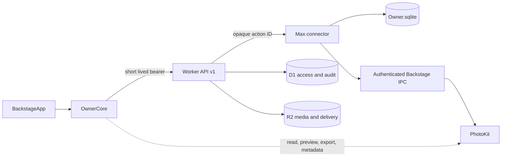

# PhotosByElie Backstage native architecture

## Purpose

PhotosByElie Backstage is the private macOS replacement for browser Owner
mutation surfaces. It may run on any enrolled Mac. Public buyer pages and
private client pages remain web applications; ordinary browser login never
grants Owner workflow actions. The first production writer is Max, and other
enrolled Macs remain readers or action submitters until an explicit authority
migration is rehearsed.

## Modules

- **BackstageApp** — SwiftUI navigation, window lifecycle, commands, status,
  and AppKit adapters for dense grids, Quick Look, keyboard selection, and
  menus. `BackstageSelectionController`, `BackstageQuickLookCoordinator`, and
  `BackstageContextMenuFactory` are the initial adapters; selection range
  semantics live in the independently tested OwnerCore model.
- **OwnerCore** — value types, use cases, API client, authentication session,
  Keychain vault, database gate, PhotoKit service, action/job progress, and
  dependency protocols. It contains no view code.
- **Worker `/api/v1`** — authentication, authorization, D1/R2 access, audit,
  durable action ledger, delivery, and sharing.
- **Max connector** — claims exact opaque actions, validates target and kind,
  owns all private `Owner.sqlite` mutations, and reports terminal results.
- **Backstage PhotoKit services** — `PhotoLibraryService` owns authorization,
  indexing, still previews, and bounded original export. `PhotoMetadataService`
  owns the approved title, caption, and managed-keyword read/write path. There
  is no separately installed or permissioned Photos helper.

## Native media and Photos give-back

`PhotoLibraryService` and `PhotoMetadataService` are the only normal-release
PhotoKit authority:

- it requests the app's Photos permission, indexes stable local identifiers,
  filename, capture date and media kind;
- it prepares bounded JPEG previews without exporting originals;
- `PhotoLibraryService` exports the preferred original resource only after an
  explicit folder choice and returns byte count, UTI and a streamed SHA-256
  receipt;
- `PhotoMetadataService` reads and applies only the approved title, caption,
  and managed keyword fields, returning per-item before/after values and
  verified failures.

The Metadata screen never calls an Apple Photos mutation API. It creates a
`sidecar-culling-review` action containing the existing
`fixture-photos-writeback-plan` or `fixture-photos-writeback-commit` manifest.
The Worker is the authorization, idempotency and audit gate. Backstage then
launches the sealed connector runtime with `--once` for that opaque action;
the process has no local status server and exits after its bounded drain. If
Backstage is closed or the child is unavailable, the durable Worker action
remains queued for the next explicit Backstage launch.

Python/browser/connector maintenance invokes the authenticated Backstage IPC
surface for both batch reads and batch writes. The signed Backstage app owns
the stable Photos permission identity, preserves unrelated keywords, returns
per-item before/after values, and records an Apple Photos receipt only after a
re-read verifies title, caption, and managed keywords. Failed item IDs remain
independently retryable; retry submits only those IDs. No production path
launches, installs, or compiles a standalone Photos helper.

## Native fixture, ACS, culling, and metadata workflows

Backstage has one global **Current fixture** at the top of its navigation
sidebar. The chooser presents the recursive hierarchy using stable fixture
IDs, restores the last-used active ID, and reports any missing or archived
preference before explicitly falling back to `fixture-expo`. If the tree or
that safe fallback is unavailable, every fixture-scoped action fails closed.
The chooser and its current breadcrumb preserve the leaf at narrow widths,
and the same selection drives Fixtures, Culling, Review, Metadata, Uploads,
Delivery, and Publication. Switching it resets transient windows and
selections only; it does not write Owner workflow state or change the active
section.

An actionable PBE Owner session freezes both the stable fixture ID and exact
breadcrumb for its lifetime. The chooser remains disabled until that session
is explicitly closed or expires, so no browser-hosted action can silently
drift to a different fixture.

The PBB-16 screens are real workflow surfaces rather than navigation
placeholders:

- **Fixtures** loads the recursive tree, creates root or child fixtures,
  renames and archives/reopens stable IDs, performs read-only universal search,
  creates immutable fixture-scoped culling snapshots, and manages reversible
  place/move/remove/restore relationships without copying source assets.
- **People & Access** reads D1 ACS state, creates or updates people and groups,
  assigns inherited group membership, and disables people or archives groups
  without deleting audit history. Email addresses are normalized by the
  Worker; passwords remain case-sensitive and are never returned to the app.
- **Culling** uses PhotoKit only to index and select local assets, then applies
  the same pick, reject, clear-pick and 0–5 rating payloads as Sidecar through
  the canonical `/sidecar/decisions/*` API with idempotency keys.
- **Metadata** can save title, caption and keyword sets, queue one or many items
  for the existing title/keyword review, replace the managed keyword
  blacklist, review pending AI proposals, and run the separate verified Apple
  Photos give-back workflow. Proposal rows are read from `Owner.sqlite` through
  the connector's read-only localhost endpoint; approve, reject and block
  remain Worker-authorized Max actions.

Fixture and metadata mutations create `sidecar-culling-review` or
`photo-moderation` actions targeted to Max. The native app posts only the
resulting opaque action ID to the localhost wake endpoint. ACS writes remain
Worker-authorized D1 mutations. None of these screens writes an Owner SQLite
business row directly.

The fixture-aware editorial state, queue, propagation, audit, and undo
invariants are defined in
[`native-review-contract.md`](native-review-contract.md). That contract is the
acceptance boundary for the native Review epic; UI behavior must not invent a
second state model.

## Authority and data flow



`Owner.sqlite` is the only local curation authority. Native code opens it
read-only for inspection unless running a named, transactional schema
migration after a verified backup. Normal mutations travel through the Worker
ledger and Max connector; no native screen writes business rows directly.
Native migrations record portable identifiers in GRDB's
`grdb_migrations(identifier)` convention while retaining `PRAGMA user_version`
for compatibility with the existing connector. A migration starts only after
a SQLite backup passes `integrity_check`; schema, migration history and version
advance in one `BEGIN IMMEDIATE` transaction and roll back together on error.

## Authentication and secrets

- Human enrollment starts only from a direct Google browser sign-in as
  `ec92009@gmail.com`. That browser surface is credential provisioning only and
  cannot X, review, hide, publish, or invoke another Owner workflow.
- A device credential is returned once and stored by Backstage in macOS
  Keychain. It is never stored in a URL, log, repo, fixture, test vector, or
  durable browser storage.
- OwnerCore re-presents it whenever it needs a fresh 15-minute bearer token;
  no long-lived refresh token is issued.
- Device and connector credentials remain different security classes.
- Sign-out deletes the local Keychain items.
- Device revocation independently blocks subsequent bearer minting.
- Cookies, OAuth secrets, connector credentials, and permanent R2 credentials
  are never embedded in the app.

## Backstage-launched PBE Owner session

The Backstage sidebar exposes the sole launch point for actionable hosted PBE
Owner mode. It starts from the authoritative current fixture, verifies the
existing loopback host readiness identities, mints a five-minute Worker session,
and opens a gallery bound to that fixture, source/catalog identity, device,
capabilities, expiry, and `pbb-79-waste-basket` lifecycle writer.

The browser receives a one-time opaque handoff in the URL fragment, removes it
immediately, and exchanges it for an HttpOnly, SameSite, session-only loopback
cookie. The browser never receives the Worker session token or device
credential. Backstage freezes the fixture while the session is active; the
Worker and host reject a missing, revoked, expired, closed, mismatched, or
unready lease.

Backstage and the Python host independently attest the launched checkout as
`git:<commit>:pbe-host-sha256:<digest>`. The digest covers the tracked Python
host and hosted gallery code declared in
`scripts/pbe_owner_host_tracked_paths.txt`. Both sides require those tracked
files to match `HEAD`, including direct blob checks that defeat
`assume-unchanged`; dirty host code fails before a bearer is sent. Ignored
root dependencies such as `node_modules` and unrelated untracked files outside
the Python import scope do not alter the identity. Before it creates the
bootstrap secret, Backstage separately rejects untracked or ignored import
modules, symlinks, special files, and executables under `scripts/`, including a
standard-library shadow such as `scripts/json.py`. The host starts with
inherited Python configuration disabled and a clean per-launch bytecode-cache
prefix; ordinary ignored `__pycache__` files therefore remain non-blocking.
Python repeats the scope check as defense in depth, while native preflight is
the required pre-import control.

Open PBE Owner captures the exact fixture synchronously. Both chooser and
fixture refresh remain disabled through the asynchronous readiness/mint/attach
sequence, and the provisional lock is released if launch fails. A browser
session generation guard prevents an older heartbeat response from restoring
`ready` after close.

Hosted gallery X and restore route through the dedicated loopback session
endpoint and shared PBB-79 gateway. Hosted PBE cannot directly create a global
tombstone or empty the Waste Basket. See
[`pbe-owner-host-session.md`](pbe-owner-host-session.md) for the complete
contract.

## Threat model

| Threat | Control |
| --- | --- |
| A compromised web view or browser sends a raw SQLite operation | Local wake accepts only an opaque action ID; connector claims and validates it through the Worker |
| A stolen access token remains useful | 15-minute lifetime, per-request device revocation check, no refresh token, device credential in Keychain |
| A connector acts for another Mac | Target and claim ownership are checked on every exact action |
| A crash partially mutates private state | Connector and migration writes use transactions; action is completed only after receipts are durable |
| A retry duplicates work | Mutation idempotency keys and durable action IDs |
| A PhotoKit failure silently loses give-back | Dry-run, explicit commit, per-item verified/failed receipts, partial retry |
| A native release breaks public delivery | Public/client sites remain independent; parity rehearsal and rollback precede web Owner retirement |

## Application lifecycle

1. Launch and load non-secret preferences.
2. Read the Keychain device identity; re-present it for a fresh bearer or
   request enrollment.
3. Check Worker health and Max connector status.
4. Open `Owner.sqlite` read-only and show its schema/version.
5. Resume non-terminal actions/jobs without resubmission.
6. On backgrounding, cancel UI-only tasks but keep durable action IDs.
7. On sign-out, clear bearer state and Keychain, close the database, and
   discard cached private previews.

Import and Upload Bridge recovery follows the same durable boundary: new work
records their worker identity and lease, while historical rows without that
evidence remain explicitly `needs-review` until an operator decides their
disposition. A missing process alone never turns an identity-free legacy row
into a claimed success or failure.

## Reversible browser cutover

The public Owner page declares its active writer on the `body` element:

- `data-owner-writer="browser"` keeps the existing mutation cards and listeners
  active.
- `data-owner-writer="backstage"` hides Build a Fixture, Waste Basket, the
  legacy Apple Photos intake, and the Owner action queue; it also skips their
  data loads and mutation listeners.

Backstage mode leaves only Google authentication and device credential
provisioning in the browser. Compatibility markup remains hidden for rollback,
but Worker routes independently reject browser workflow mutation. Re-enabling
markup alone cannot restore browser Owner authority.

Max completed the gate on 2026-07-25: one-time device enrollment, cold
Keychain session restoration, read-only `Owner.sqlite` access, explicit Photos
approval, a 2,000-item PhotoKit index, and a Worker-audited two-item
`metadata-read-many` dry-run. The action completed with zero read errors, no
previews, no publication or client message, and an unchanged Owner database.
The production attribute is therefore `data-owner-writer="backstage"`.

## Extension seams

- `OwnerAPITransport` allows URLSession now and test/offline transports.
- `OwnerDatabaseReading` keeps UI use cases independent of SQLite details.
- `PhotoLibraryServing` isolates PhotoKit authorization and export.
- `OwnerActionServing` and `OwnerActionRunner` allow future enrolled Macs to
  submit actions without becoming writers.
- Server-declared capabilities hide unsupported workflows on non-authoritative
  devices.

Multi-Mac writer election remains outside this architecture. Mobile Owner UI is
not a target; customer and client mobile web remain supported.
Browser Owner retirement is implemented as the reversible active-writer gate
above rather than deletion of the compatibility surface.

The completed `v147.6` native-only cutover, verification evidence, reversible
legacy-app archive, and rollback procedure are recorded in
[`backstage-native-cutover-2026-07-25.md`](backstage-native-cutover-2026-07-25.md).

## Native publication lifecycle rehearsal

PBB-63 has a checked-in, repeatable Max rehearsal for the complete native
publication safety path:

```sh
python3 scripts/native_publication_rehearsal.py \
  --report docs/rehearsals/pbb-63-native-publication.json
```

The rehearsal uses temporary Owner and catalog databases plus synthetic R2
upload/delete adapters. It drives the Backstage connector contract through
Photos sync, inherited ACS access, partial publication and retry, local catalog
registration, exact sale-object protection, first-pass quarantine,
referenced-object restoration, and later-pass cleanup. Before/after SHA-256
guards prove that the live Owner database and public/client artifacts were not
changed. The recorded 2026-08-06 run passed on signed Backstage 218.0 build 75
on Max; its detailed evidence is in
[`pbb-63-native-publication.json`](../rehearsals/pbb-63-native-publication.json).
