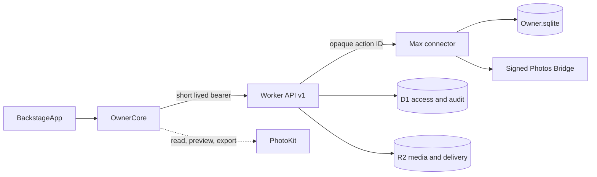

# PhotosByElie Backstage native architecture

## Purpose

PhotosByElie Backstage is the private macOS replacement for browser Owner
mutation surfaces. Public buyer pages and private client pages remain web
applications. The first production writer is Max; future Mac and mobile
clients are readers and action submitters until an explicit authority
migration is rehearsed.

## Modules

- **BackstageApp** — SwiftUI navigation, window lifecycle, commands, status,
  and AppKit adapters for dense grids, Quick Look, keyboard selection, and
  menus.
- **OwnerCore** — value types, use cases, API client, authentication session,
  Keychain vault, database gate, PhotoKit service, action/job progress, and
  dependency protocols. It contains no view code.
- **Worker `/api/v1`** — authentication, authorization, D1/R2 access, audit,
  durable action ledger, delivery, and sharing.
- **Max connector** — claims exact opaque actions, validates target and kind,
  owns all private `Owner.sqlite` mutations, and reports terminal results.
- **Photos Bridge** — the existing signed PhotoKit writer for title, keyword,
  and receipt give-back. Backstage may read, select, preview, and export
  through PhotoKit; it does not create a second metadata writer.

## Authority and data flow

`Owner.sqlite` is the only local curation authority. Native code opens it
read-only for inspection unless running a named, transactional schema
migration after a verified backup. Normal mutations travel through the Worker
ledger and Max connector; no native screen writes business rows directly.

## Authentication and secrets

- Human enrollment starts from a current Owner session.
- A device credential is returned once and stored in Keychain.
- OwnerCore exchanges it for a 15-minute bearer token and rotating 30-day
  refresh token.
- Refresh tokens and connector credentials are different security classes.
- Sign-out deletes the local Keychain items and revokes the refresh token.
- Device revocation is independent and invalidates its indexed refresh tokens.
- Cookies, OAuth secrets, connector credentials, and permanent R2 credentials
  are never embedded in the app.

## Threat model

| Threat | Control |
| --- | --- |
| A compromised web view or browser sends a raw SQLite operation | Local wake accepts only an opaque action ID; connector claims and validates it through the Worker |
| A stolen device token remains useful | Short-lived access token, rotating refresh token, per-device revocation, Keychain storage |
| A connector acts for another Mac | Target and claim ownership are checked on every exact action |
| A crash partially mutates private state | Connector and migration writes use transactions; action is completed only after receipts are durable |
| A retry duplicates work | Mutation idempotency keys and durable action IDs |
| A PhotoKit failure silently loses give-back | Dry-run, explicit commit, per-item verified/failed receipts, partial retry |
| A native release breaks public delivery | Public/client sites remain independent; parity rehearsal and rollback precede web Owner retirement |

## Application lifecycle

1. Launch and load non-secret preferences.
2. Read Keychain identity; refresh or request enrollment.
3. Check Worker health and Max connector status.
4. Open `Owner.sqlite` read-only and show its schema/version.
5. Resume non-terminal actions/jobs without resubmission.
6. On backgrounding, cancel UI-only tasks but keep durable action IDs.
7. On sign-out, revoke refresh state, clear Keychain, close the database, and
   discard cached private previews.

## Extension seams

- `OwnerAPITransport` allows URLSession now and test/offline transports.
- `OwnerDatabaseReading` keeps UI use cases independent of SQLite details.
- `PhotoLibraryServing` isolates PhotoKit authorization and export.
- `OwnerActionSubmitting` allows future Macs and mobile devices to submit
  actions without becoming writers.
- Server-declared capabilities hide unsupported workflows on non-authoritative
  devices.

Multi-Mac writer election, mobile Owner UI, and browser Owner retirement are
deliberately not implemented by this architecture.

